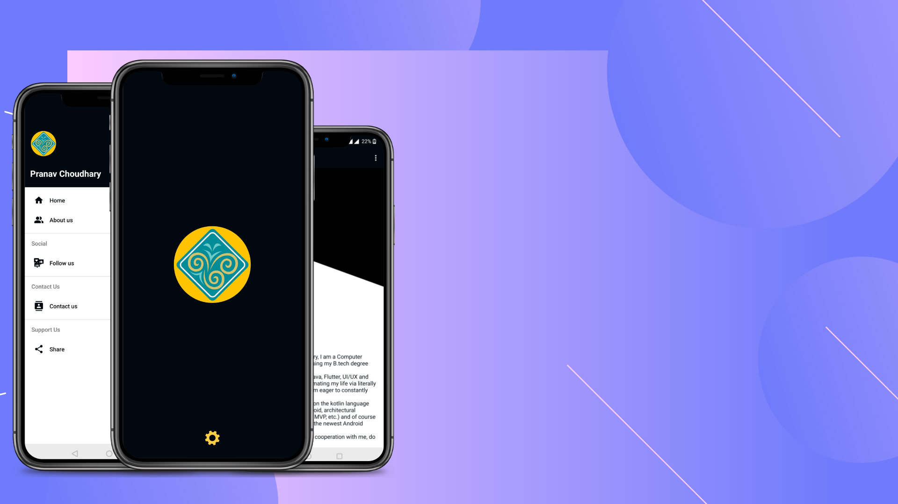
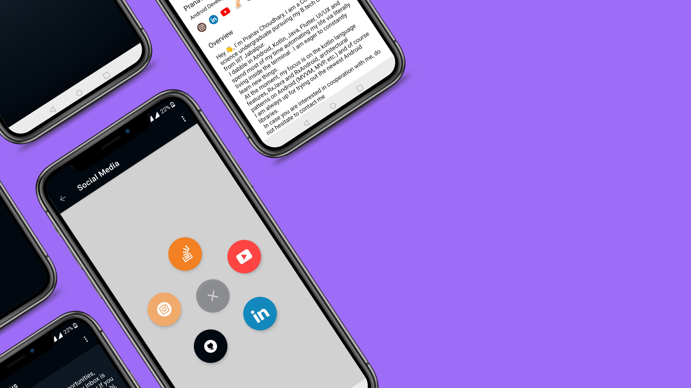
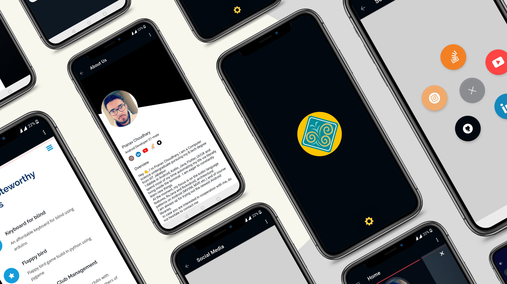

# MyPortfolio-App

This app is just an Android WebView Example with Kotlin.In this app I turned my portfolio  Website into Native Android App.

 # Screenshots
 
 

# How to use:

- Download or Clone this project

- Import project In your android studio

- Go to app-> java-> com.portfolio.pranavelric-> utils and open Constants.kt and change the following:-
  

   
         const val SITE_URL = "your website url"
         const val YOUTUTBE_URL = "your youtube url"
         const val LINKEDIN_URL = "your linkedin url"
         const val STACK_URL = "your stackoverflow url"
         const val INSTAGRAM_URL = "your Instagram url"
         const val GITHUB_URL = "your github url"
                       
- Go to app-> res->  values and open strings.xml and change the following   
   
   
      <string name="app_name">Your app name</string>
      <string name="your_name">Your name</string>
      <string name="your_profession">Your profession</string>
      <string name="about_me">
                  About you
      </string>

      <string name="your_age">•Your age</string>
      <string name="your_gender">•Your gender</string>
      <string name="contact_intro">"Your intro"</string>
      <string name="your_phone_number">Your contact number </string>
      <string name="your_email">your email</string>
      <string name="your_address">your address</string>

   
   

# Libraries  used
- Gif view: https://github.com/Cutta/GifView

- Circle menu: https://github.com/Ramotion/circle-menu-android

- Diagonal layout: https://github.com/florent37/DiagonalLayout

- Glide: https://github.com/bumptech/glide
